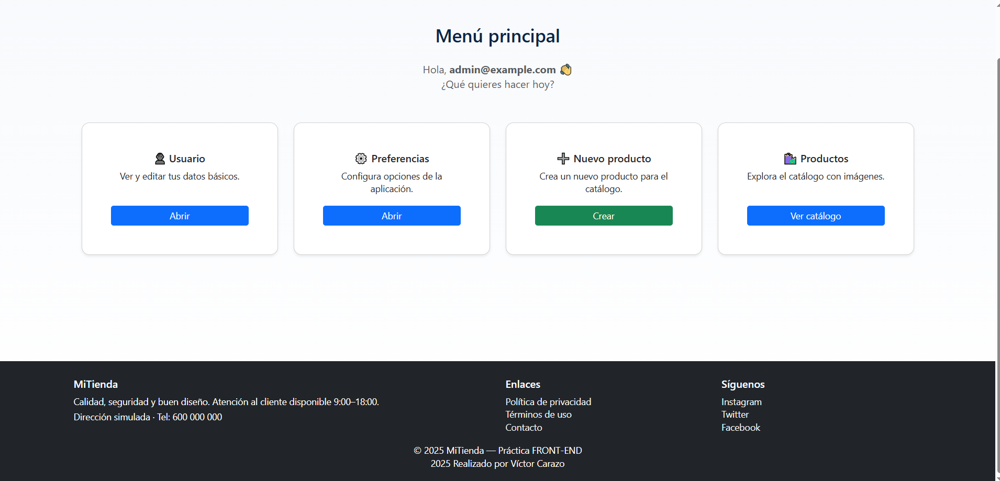

# 📘 Práctica 3 --- Migración a Arquitectura MVC

### Desarrollo Front-End + Integración Flask

**Autor:** Víctor Carazo\
**Curso:** 2025--2026

------------------------------------------------------------------------

# 📑 Índice  
1. [Introducción](#-introducción)  
2. [Estructura del Proyecto](#-estructura-del-proyecto)  
3. [Diagrama Arquitectural MVC](#-diagrama-arquitectural-mvc)  
4. [Responsabilidad de Cada Componente](#-responsabilidad-de-cada-componente)  
5. [MVC en el Backend (Flask)](#-mvc-en-el-backend-flask)  
6. [MVC en el Frontend (JavaScript ES6)](#-mvc-en-el-frontend-javascript-es6)  
7. [Carrito MVC](#-carrito-mvc)   
8. [Evidencias de la separación MVC](#-evidencias-de-la-separación-mvc)
9. [Capturas del proyecto](#-capturas-del-proyecto)
10. [Autenticación con Flask-Login](#-autenticación)  
11. [Reflexión: Beneficios y Desafíos del Patrón MVC](#-reflexión-beneficios-y-desafíos-del-patrón-mvc)  
12. [Cómo ejecutar el proyecto](#-docker)  
13. [Conclusiones](#-conclusiones)

------------------------------------------------------------------------

# 🚀 Introducción

Esta práctica consiste en migrar las Prácticas 1 y 2 ---basadas en HTML,
CSS y JavaScript puros--- hacia una aplicación web estructurada mediante
el patrón Modelo--Vista--Controlador (MVC) utilizando:

-   Flask (backend)
-   SQLAlchemy + SQLite
-   Jinja2
-   Flask-Login
-   MVC en JavaScript (frontend)
-   Docker y docker-compose
-   CLI personalizada (init-db y create-user)

El objetivo final es obtener una arquitectura escalable, mantenible y
modular, respetando la experiencia de usuario y el dinamismo
implementado en las prácticas anteriores.

------------------------------------------------------------------------

# 📁 Estructura del Proyecto

    flask_mvc_login/
    ├── app/
    │   ├── __init__.py
    │   ├── models.py
    │   ├── controllers/
    │   │   ├── auth.py
    │   │   └── main.py
    │   ├── templates/
    │   │   ├── base.html
    │   │   ├── login.html
    │   │   ├── registro.html
    │   │   ├── productos.html
    │   │   ├── usuario.html
    │   │   ├── preferencias.html
    │   │   └── nuevo.html
    │   └── static/
    │       ├── css/
    │       ├── js/
    │       │   ├── app.js
    │       │   ├── loginModel.js
    │       │   ├── loginView.js
    │       │   ├── loginController.js
    │       │   ├── registerModel.js
    │       │   ├── registerView.js
    │       │   ├── registerController.js
    │       │   ├── ProductModel.js
    │       │   ├── ProductView.js
    │       │   ├── ProductController.js
    │       │   └── (carrito MVC en proceso)
    │       └── img/ & products/
    ├── wsgi.py
    ├── requirements.txt
    ├── Dockerfile
    ├── docker-compose.yml
    ├── run.py
    └── README.md

------------------------------------------------------------------------

# 🧩 Diagrama Arquitectural MVC

```
              ┌──────────────────────────────┐
              │            Usuario           │
              └──────────────┬───────────────┘
                             │
                        HTTP / Eventos
                             │
           ┌─────────────────┴────────────────────────────────────────┐
           │              Frontend                                    │
           │         (MVC en JavaScript)                              │
           ├─────────────────┬───────────────────┬────────────────────┤
           │ Model JS        │ View JS           │ Controller JS      │
           │ - Validación    │ - Renderizado     │ - Orquesta eventos │
           │ - Estado        │ - DOM             │ - Coordina módulos │
           └─────────────────┴───────────────────┴────────────────────┘
                             │
                        Peticiones
                             │
           ┌─────────────────┴────────────────────────────────────────┐
           │              Backend (Flask MVC)                         |
           ├─────────────────┬───────────────────┬────────────────────┤
           │ Model Python    │ Views (Jinja2)    │ Controllers        │
           │ - SQLAlchemy    │ - Plantillas      │ - Rutas            │
           │ - DB            │ - HTML dinámico   │ - Lógica servidor  │
           └─────────────────┴───────────────────┴────────────────────┘
                             │
                        Base de Datos
```

```
                 BACKEND (Flask)
     ┌───────────┐     ┌───────────────┐     ┌───────────────┐
     │  Modelo   │ <-->│  Controlador  │ <-->│      Vista    │
     │ SQLAlchemy│     │ (auth, main)  │     │   Jinja2 HTML │
     └───────────┘     └───────────────┘     └───────────────┘
                           ▲
                           │ JSON
                           ▼
                FRONTEND (JavaScript ES6)
     ┌───────────┐     ┌───────────────┐     ┌───────────────┐
     │  Modelo   │ <-->│  Controlador  │ <-->│      Vista    │
     │  (valid.) │     │  (eventos)    │     │ DOM / Render  │
     └───────────┘     └───────────────┘     └───────────────┘
```
------------------------------------------------------------------------

# 🎯 Responsabilidad de Cada Componente

### ✔ Modelo  
- Python: gestiona la base de datos y entidades.  
- JS: valida datos y maneja estado (login, registro, carrito).  

### ✔ Vista  
- Plantillas Jinja2 en backend.  
- Manipulación del DOM en frontend.  

### ✔ Controlador  
- Backend: rutas y lógica empresarial.  
- Frontend: escucha eventos y coordina vista/modelo.

------------------------------------------------------------------------

# 🏛 MVC en el Backend (Flask)

### ✔ Modelos (`models.py`)
- `User`: autenticación, hash de contraseña.  
- `Product`: catálogo con precio e imagen.

### ✔ Controladores
- `auth.py`: login/logout/registro.  
- `main.py`: menú, productos, preferencias, CRUD.

### ✔ Vistas
- HTML generado con Jinja2  
- Uso de plantillas base  
- Accesibilidad garantizada

---

# 🧠 MVC en el Frontend (JavaScript ES6)

### ✔ Modelos (JS)
Validan y gestionan estado.

### ✔ Vistas (JS)
Renderizan HTML dinámico y actualizan la interfaz.

### ✔ Controladores (JS)
Orquestan eventos y flujos de interacción.

---

# 🛒 Carrito MVC

### CartModel  
Maneja items, totales y persistencia en localStorage.

### CartView  
Renderiza lista, totales y botones del carrito.

### CartController  
Coordina interacciones entre vista y modelo.

------------------------------------------------------------------------

# 🏛 Arquitectura MVC (Backend)

El backend sigue estrictamente el patrón MVC:

## ✔ Modelo (`models.py`)

-   User: autenticación, hash de contraseña, integración con
    Flask-Login\
-   Product: catálogo, precio e imagen\
-   Persistencia con SQLite usando SQLAlchemy

## ✔ Controladores (`auth.py`, `main.py`)

-   Gestión de login/logout\
-   Protección de rutas con @login_required\
-   Flujo principal del menú, preferencia de usuario, productos y
    creación de nuevos

## ✔ Vistas (`templates/*.html`)

-   Plantillas Jinja2\
-   Extienden `base.html`\
-   Separan completamente lógica y presentación

---

# 📌 Evidencias de la separación MVC

- Código organizado en módulos.  
- No hay lógica de negocio en el HTML.  
- Backend y frontend aislados.  
- Carrito completamente independiente del backend.  
- Plantillas separadas de controladores.

------------------------------------------------------------------------

# 🧠 MVC en Frontend (JavaScript)

Toda la lógica se modularizó en **Model--View--Controller** en ES6:

### Modelo

Valida datos, gestiona estado, ejecuta reglas de negocio.\
(Ej.: `loginModel.js`, `registerModel.js`, `ProductModel.js`)

### Vista

Manipula DOM, renderiza productos, muestra mensajes y aplica
accesibilidad.\
(Ej.: `loginView.js`, `ProductView.js`)

### Controlador

Orquesta eventos, coordina vista y modelo.\
(Ej.: `loginController.js`, `ProductController.js`)

------------------------------------------------------------------------

# 📸 Capturas del proyecto

### Registro  


### Login  


### Menú principal  



### Catálogo  


### Preferencias


### Nuevo producto


### Usuario


------------------------------------------------------------------------

# 🔐 Autenticación

Implementada con Flask-Login:\
- Sesiones seguras\
- Redirecciones automáticas\
- Carga de usuarios\
- Hash de contraseñas

------------------------------------------------------------------------

# 🛍️ Catálogo + Filtros + Datos desde Backend

Los productos se consultan desde SQLite y se envían al frontend como
JSON seguro:

    window.productsData = {{ products_data|tojson|safe }};

El frontend los recibe y renderiza mediante MVC.

------------------------------------------------------------------------

# 🛒 Carrito 

El carrito de P2 se integrará como:\
- CartModel.js\
- CartView.js\
- CartController.js

Con persistencia en localStorage y futura conexión al backend.

------------------------------------------------------------------------

# 🐳 Docker

## Arranque sin Docker

``` bash
python -m venv .venv
source .venv/bin/activate     # Windows: .venv\Scripts\activate
pip install -r requirements.txt
cp .env.example .env
python run.py
# Abrir http://localhost:5000
```

## Con Docker

``` bash
cp .env.example .env
docker compose up --build
# Abrir http://localhost:5000
```

------------------------------------------------------------------------

# 🔧 CLI (Herramientas incluidas)

Crear base de datos + datos demo:

``` bash
flask --app wsgi.py init-db
```

Crear usuario adicional:

``` bash
flask --app wsgi.py create-user email password
```

------------------------------------------------------------------------

# ⚠️ Dificultades y Soluciones

### Migración del login

Solución: separar validación en MVC JS conservando accesibilidad.

### Paso Python → JS

Solución: serialización segura mediante `tojson|safe`.

### Problemas con VS Code y Jinja

Solución: ajustar el intérprete Python y usar filtros Jinja.

### Mantener experiencia responsive

Solución: conservar Bootstrap 5 y adaptar componentes.

------------------------------------------------------------------------

# 📌 Conclusiones

-   El proyecto pasó de un frontend monolítico a una arquitectura
    completa MVC + MVC JS.\
-   Flask gestiona seguridad, datos y rutas.\
-   El frontend gestiona dinamismo modular.\
-   Docker asegura portabilidad profesional.\
-   La aplicación es ahora escalable, mantenible y clara.

---

# 🏁 Resumen Final

La aplicación evoluciona desde páginas estáticas hacia una arquitectura **full-stack MVC**, con:

- Autenticación segura  
- Catálogo dinámico  
- Carrito persistente  
- Modularidad backend–frontend  
- Despliegue con Docker  

Una base profesional y lista para ampliarse.

---

# 💭 Reflexión: Beneficios y Desafíos del Patrón MVC

### ✔ Beneficios
- Código más limpio y organizado.  
- Escalabilidad.  
- Posibilidad de trabajar por capas.  
- Facilita pruebas y mantenimiento.

### ✔ Desafíos
- Mayor número de archivos.  
- Necesidad de disciplina en la separación.  
- Curva inicial para organizar código.

------------------------------------------------------------------------

**Fin del README**
